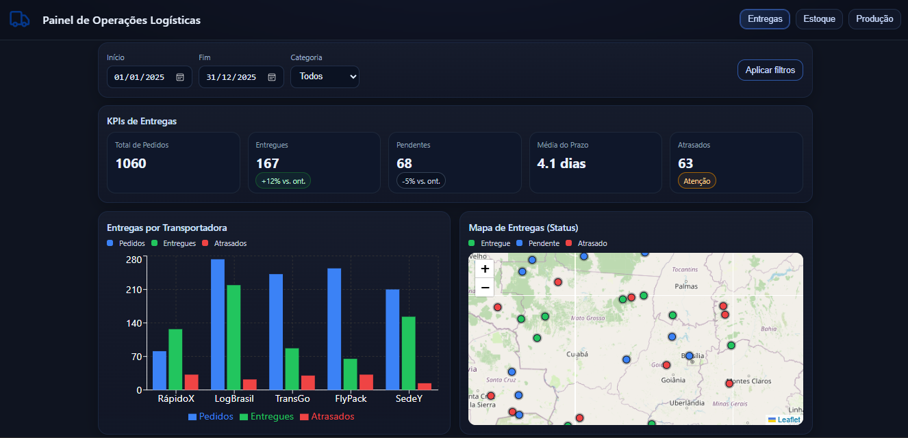
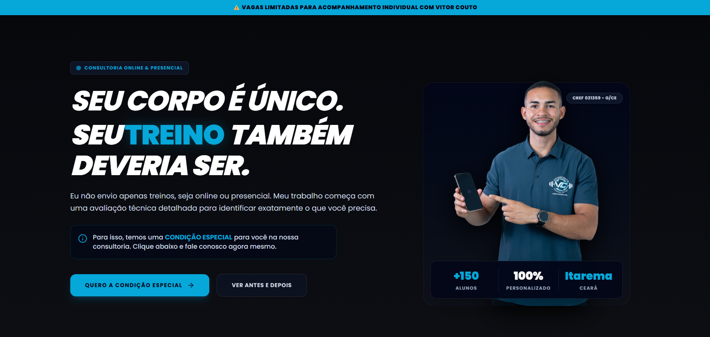
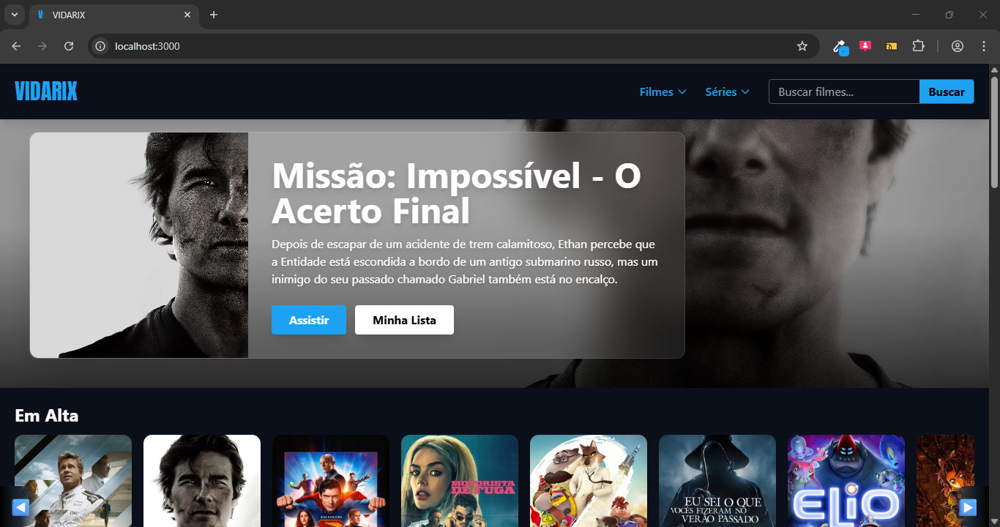
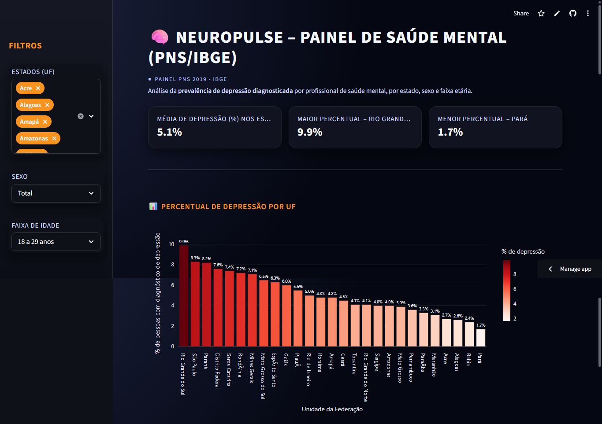

# 🚀 Portfólio — Janderson Vidal

Welcome to my online portfolio!  
I am a **Full Stack Developer**, passionate about transforming ideas into complete digital solutions, working on both the front-end and back-end with a focus on performance, usability, and best development practices.

> **Stacks:** React.js, Next.js, Node.js, NestJS, SQL, Python, PHP.
  
---------------------------------------------------------------------------------------------------------------------------

## 📌 About Me
💻 **Full-Stack Developer | React.js | Node.js | SQL | Python | PHP**  
🎓 Computer Science student  
🔍 Focus on clean, scalable code and best practices.  
📈 Experience with responsive design, robust APIs, and modern integrations.

---------------------------------------------------------------------------------------------------------------------------

## 🛠️ Technologies

  
---------------------------------------------------------------------------------------------------------------------------

## 📂 Featured Projects

### 🚚 Logistics Operations Panel
An interactive dashboard developed in **React** for analyzing product shipments throughout Brazil. The platform displays metrics and visualizations on shipped, canceled, and delayed products, allowing for logistical tracking through interactive graphs, real-time indicators, and regional filters.

**Technologies:** React, Vite, Recharts, Leaflet + React Leaflet, TailwindCSS  

  
🔗 [See project](https://github.com/DevJVidal/painel-operacoes-logisticas)

---------------------------------------------------------------------------------------------------------------------------

### 💪 Landing Page Vitor Couto
A high-performance digital solution custom-built for personal trainers and elite coaches who want to position their work as a premium service, automatically screen potential clients, and close high-value consulting deals directly via WhatsApp.

**Technologies:** React 18+, TypeScript, Vite, TailwindCSS, Framer Motion, Lucide React, API do IBGE, API do WhatsApp  

  
🔗 [See project](https://vitor-couto-personal.vercel.app/)
  
---------------------------------------------------------------------------------------------------------------------------

### 🎬 Vidarix
An interactive streaming platform in the style of Netflix, developed in Next.js, for exploring movies and series in a dynamic and intuitive way. The project offers fluid navigation, a catalog organized by categories, intelligent search, and a responsive interface integrated with Tailwind CSS, with animations and loading optimized through Vercel, ensuring high performance and an immersive user experience.

**Technologies:** Next.js, React, TailwindCSS, TMDB. API  

🔗 [See project](https://github.com/DevJVidal/vidarix)
  
---------------------------------------------------------------------------------------------------------------------------

### 🧠 NeuroPulse – Mental Health Panel
NeuroPulse is an interactive dashboard developed in Python with an interface built using Streamlit, created to analyze the prevalence of depression diagnosed by mental health professionals in Brazil. The project is based on real data from the 2019 National Health Survey (PNS), extracted directly from the SIDRA/IBGE platform, maintained by the Brazilian Institute of Geography and Statistics (IBGE). The application allows for the visualization of metrics, comparative analyses, and interactive filtering of indicators, contributing to studies and monitoring of the mental health landscape in the country.  

**Technologies:** Python, Streamlit, Pandas, Plotly Express, Pathlib, Unicodedata

🔗 [See project](https://github.com/DevJVidal/neuropulse)

---------------------------------------------------------------------------------------------------------------------------

## 🌐 Access my portfolio
🔗 [**Click here to visit**](https://devjvidal.github.io/meu-portfolio/)
  
---------------------------------------------------------------------------------------------------------------------------

## 📬 Contact
- **Email:** [jandersonvidalvidal14@gmail.com](mailto:jandersonvidalvidal14@gmail.com)  
- **LinkedIn:** [Janderson Vidal](https://www.linkedin.com/in/janderson-vidal)  
- **GitHub:** [DevJVidal](https://github.com/DevJVidal)  
- **WhatsApp:** [Send message](https://wa.me/5588993203616)
  
---------------------------------------------------------------------------------------------------------------------------

## 📜 This project is licensed under the **MIT License**.
- [License](https://github.com/DevJVidal/painel-operacoes-logisticas?tab=License-1-ov-file)

---------------------------------------------------------------------------------------------------------------------------

👨‍💻 Developed by **Janderson Vidal**
