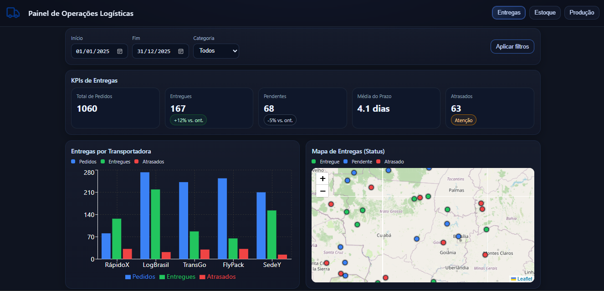
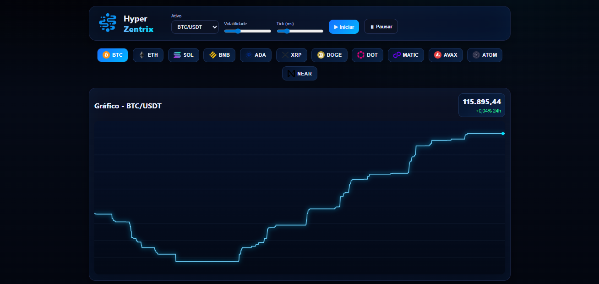

# 🚀 Portfólio — Janderson Vidal

Bem-vindo(a) ao meu portfólio online!  
Sou **Desenvolvedor Full Stack** apaixonado por transformar ideias em soluções digitais completas, desde o **front-end** até o **back-end**.

> **Stacks principais:** React.js, Next.js, Node.js, NestJS, SQL, Python.
  
---------------------------------------------------------------------------------------------------------------------------

## 📌 Sobre Mim
💻 **Full Stack Developer | React.js | Node.js | SQL | Python**  
🎓 Estudante de Ciência da Computação  
🔍 Foco em código limpo, escalável e boas práticas  
📈 Experiência com projetos responsivos, APIs robustas e integrações modernas

---------------------------------------------------------------------------------------------------------------------------

## 🛠️ Tecnologias

  
---------------------------------------------------------------------------------------------------------------------------

## 📂 Projetos em Destaque

### 🚚 Painel de Operações Logísticas
Um dashboard interativo desenvolvido em **React** para análise de envios de produtos em todo o Brasil. A plataforma exibe métricas e visualizações sobre produtos enviados, cancelados e com entregas em atraso, permitindo o acompanhamento logístico por meio de gráficos interativos, indicadores em tempo real e filtros regionais.

**Tecnologias:** React, Vite, Recharts, Leaflet + React Leaflet, TailwindCSS  

  
🔗 [Ver projeto](https://devjvidal.github.io/painel-operacoes-logisticas/)

---------------------------------------------------------------------------------------------------------------------------

### 💰 SIMULADOR DE TRADE
Um dashboard interativo desenvolvido em React para simulação de compras e vendas de criptomoedas. A plataforma permite operar com preços de mercado em tempo real, visualizar métricas de desempenho e testar estratégias financeiras sem riscos reais. O sistema integra dados de criptoativos como Bitcoin e Ethereum, além de oferecer gráficos interativos construídos com bibliotecas como o Recharts e controle de negociações por meio do Redux, tornando a análise dinâmica e intuitiva.

**Tecnologias:** HTML5, CSS3, JavaScript (ES6+)  

  
🔗 [Ver projeto](https://devjvidal.github.io/simulador-trade/)
  
---------------------------------------------------------------------------------------------------------------------------

### 🎬 Vidarix
Uma plataforma interativa de streaming no estilo do Netflix, desenvolvida em Next.js, para explorar filmes e séries de forma dinâmica e intuitiva. O projeto oferece navegação fluida, catálogo organizado por categorias, busca inteligente e interface responsiva integrada ao Tailwind CSS, com animações e carregamentos otimizados por meio do Vercel, garantindo alto desempenho e experiência imersiva ao usuário.

**Tecnologias:** Next.js, React, TailwindCSS, TMDB. API  

🔗 [Ver projeto](https://example.com)
  
---------------------------------------------------------------------------------------------------------------------------

### 🧠 NeuroPulse – Painel de Saúde Mental
O NeuroPulse é um painel interativo desenvolvido em Python com interface construída utilizando o Streamlit, criado para analisar a prevalência de depressão diagnosticada por profissionais de saúde mental no Brasil. O projeto é baseado em dados reais da PNS 2019, extraídos diretamente da plataforma SIDRA/IBGE, mantida pelo IBGE. A aplicação permite a visualização de métricas, análises comparativas e filtragem interativa de indicadores, contribuindo para estudos e acompanhamento do cenário da saúde mental no país.

**Tecnologias:** Python, Streamlit, Pandas, Plotly Express, Pathlib, Unicodedata

🔗 [Ver projeto](https://neuropulse-bigdatapython.streamlit.app)

---------------------------------------------------------------------------------------------------------------------------

## 🌐 Acesse meu portfólio
🔗 [**Clique aqui para visitar**](https://devjvidal.github.io/meu-portfolio/)
  
---------------------------------------------------------------------------------------------------------------------------

## 📬 Contato
- **Email:** [jandersonvidalvidal14@gmail.com](mailto:jandersonvidalvidal14@gmail.com)  
- **LinkedIn:** [Janderson Vidal](https://www.linkedin.com/in/janderson-vidal)  
- **GitHub:** [DevJVidal](https://github.com/DevJVidal)  
- **WhatsApp:** [Enviar mensagem](https://wa.me/5588993203616)
  
---------------------------------------------------------------------------------------------------------------------------

## 📜 Este projeto é licenciado sob a **Licença MIT**.
- [Licença](https://github.com/DevJVidal/painel-operacoes-logisticas?tab=License-1-ov-file)

---------------------------------------------------------------------------------------------------------------------------

👨‍💻 Desenvolvido por **Janderson Vidal**
